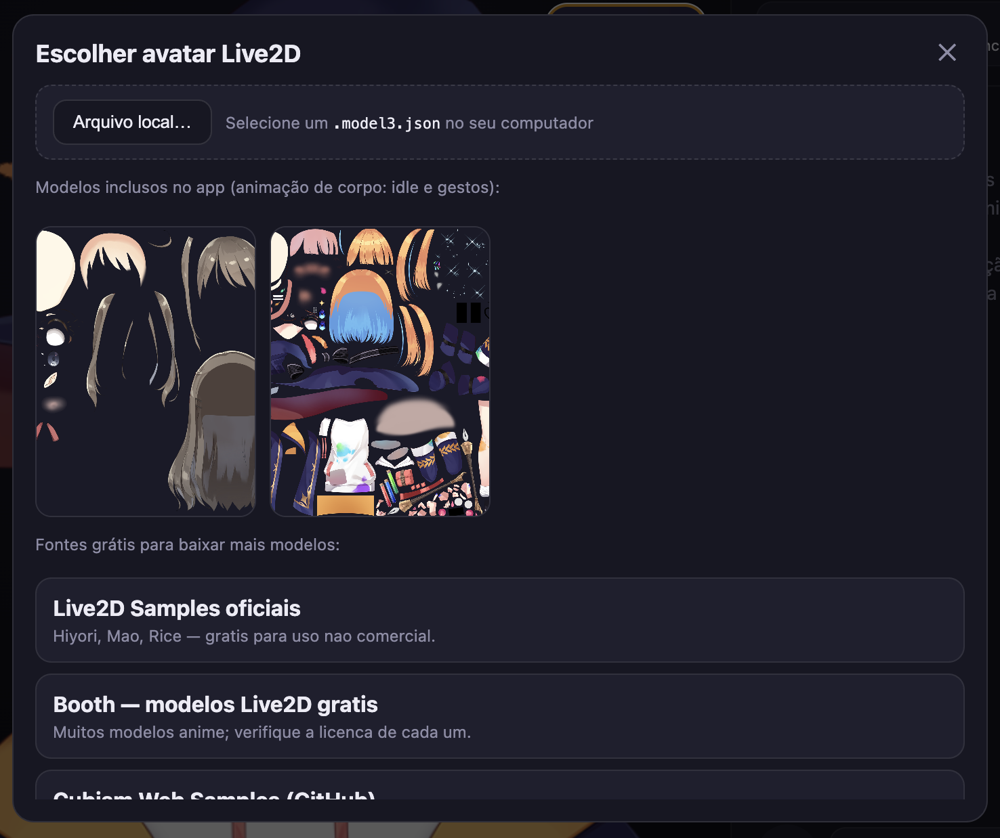
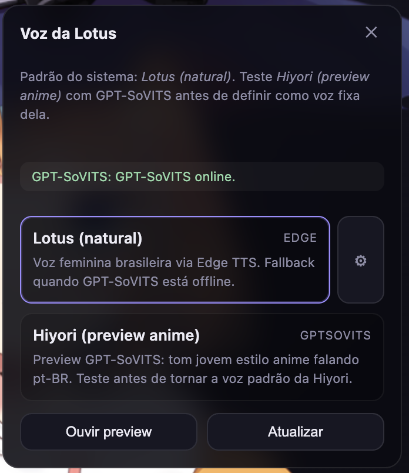
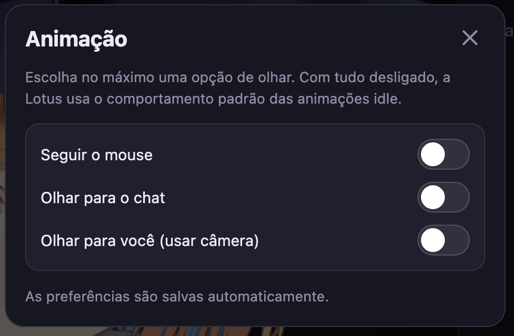
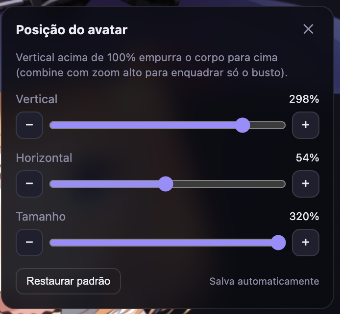

# Lotus


Companion de desktop com **IA local**: avatar **Live2D** animado, chat por texto ou microfone, voz feminina em pt-BR, lip-sync e **agente no computador**. Roda no seu PC (Windows e macOS).


## Começar

### Primeira vez

```bash
npm install
npm run setup:live2d
npm run dev
```

Na **primeira abertura**, se ainda não houver cérebro instalado, o painel **Cérebro** mostra duas opções — **Hermes 3** (~5 GB, padrão do projeto) ou **Qwen** (~2 GB, alternativa leve). O download começa pela própria interface.

| Opção | Download | Uso |
|--------|----------|-----|
| **Hermes 3** | ~5 GB | Padrão — chat, agente e function calling |
| **Qwen 2.5** | ~2 GB | Alternativa leve para comparação ou máquinas muito limitadas |

> **Memória:** Hermes 8B + Electron + Live2D usa bastante RAM. Em dev, feche apps pesados em paralelo se o sistema ficar lento.

Alternativa pelo terminal (opcional):

```bash
npm run setup:models        # Hermes 3 (recomendado)
npm run setup:models:qwen   # Qwen (opcional)
```

Os dois `.gguf` podem coexistir em `models/llm/`. **Auto** e o padrão inicial preferem **Hermes** quando instalado.

Detalhes dos modelos: [models/README.md](models/README.md)

### Abrir o app

```bash
npm run dev
```

Aguarde **IA pronta** (bolinha verde) antes de conversar.


---

## Funcionalidades

### Conversa

- Chat em **português do Brasil** com LLM local (`node-llama-cpp`)
- **Pesquisa interna** — *«pesquisa sobre X»* → Lotus busca na web e **te responde** no chat
- **Busca no navegador** — *«pesquisa X no Google»* → abre o Google no browser (com confirmação)
- **Interrupção** — nova mensagem ou microfone para a fala anterior na hora
- Atalhos sem LLM: cumprimentos variados (*oi*), *chega* / *para*

### Agente no computador

A Lotus pode agir no SO **com confirmação do usuário**:

| Ferramenta | Exemplo |
|------------|---------|
| Abrir Google | *«pesquisa receita de bolo no google»* |
| Abrir app | *«abre o Spotify»* |
| Abrir link | *«abre https://…»* |

Planejamento via **function calling** (Hermes 3) + fallback heurístico. Ações repetidas recebem resposta irônica (não executa de novo).

### Avatar e voz

- **Live2D** — Hiyori (padrão), Mao na galeria; importe `.model3.json` ou use **Galeria → Arquivo local**
- **Olhar** — mouse, chat (enquanto digita) ou câmera (MediaPipe, local)
- **Voz** — *Lotus (natural) · Francisca* (Edge TTS); lip-sync e gestos
- **Painel** — avatar, voz, **Cérebro**, CPU/RAM, status da IA

### Menu ⚙ (canto da stage)

**Galeria**, **Voz**, **Animação** e **Posição**:

| Galeria | Voz |
|:---:|:---:|
|  |  |

| Animação | Posição |
|:---:|:---:|
|  |  |

---

## Comandos npm

| Comando | Descrição |
|---------|-----------|
| `npm run dev` | Desenvolvimento (Electron + hot reload) |
| `npm run build` | Build de produção |
| `npm run setup:models` | Baixa Hermes 3 8B GGUF (~5 GB) |
| `npm run setup:models:qwen` | Baixa Qwen 2.5 3B GGUF (~2 GB) |
| `npm run setup:live2d` | Assets Live2D bundled |
| `npm run typecheck` | Verificação TypeScript |
| `npm run dist:win` | Instalador Windows (.exe) |
| `npm run dist:mac` | Instalador macOS (.dmg) |

---

## Opcional

Não é necessário para o uso diário.

### Voz *Lotus (natural) · Francisca*

- Edge TTS **Francisca** (pt-BR) — precisa de **internet** ao falar
- Fallback: Web Speech API do sistema
- Ajustes em **⚙ → Voz**

### Voz anime — *Hiyori (preview)* (experimental)

```bash
npm run setup:voice-ref
npm run setup:gptsovits
npm run gptsovits:start   # outro terminal
```

| | Voz padrão | Voz anime |
|---|---|---|
| Nome | *Lotus (natural) · Francisca* | *Hiyori (preview anime)* |
| Setup | Nenhum extra | Comandos acima |
| Motor | Edge TTS | GPT-SoVITS local |

---

## Documentação

- [Checklist e roadmap](CHECKLIST.md)
- [Modelos LLM locais](models/README.md)
- [Avatares — galeria e modelos locais](docs/AVATARS.md)

---

## Estrutura do projeto

```
src/
├── main/
│   ├── services/
│   │   ├── agent/          # Agente SO (tools, planner, memória)
│   │   ├── conversation/   # Atalhos (oi, chega, para)
│   │   ├── intent/         # Browser vs pesquisa interna
│   │   ├── llm.ts          # Chat + research + Hermes/Qwen
│   │   ├── llmProfile.ts   # Seletor Hermes / Qwen
│   │   ├── search/         # Busca web (providers)
│   │   └── tts/            # Edge TTS
│   └── index.ts            # IPC Electron
├── renderer/
│   └── src/
│       ├── agent/          # UI confirmação do agente
│       ├── avatar/         # Live2D, olhar, lip-sync
│       └── hooks/          # Conversa + interrupção
├── shared/                 # Tipos e contratos IPC
models/                     # GGUF e assets (não versionados)
Screenshot/                 # Capturas de tela
```

---

## Observações

- **Câmera (olhar para você)** — permissão local; MediaPipe no renderer, nada enviado à internet
- **Microfone / STT** — Whisper em integração; use texto se a transcrição falhar no seu ambiente
- **Agente** — ações destrutivas pedem confirmação; arquivos/pastas ainda não implementados (ver [CHECKLIST.md](CHECKLIST.md))
- Modelos Live2D oficiais seguem licença Live2D (uso não comercial). Ver licença de cada modelo externo
