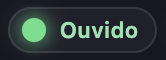

# Lotus


Companion de desktop com **IA local**: avatar **Live2D** animado, chat por texto ou microfone, voz em pt-BR, lip-sync e **agente no computador**. Roda no seu PC (Windows e macOS).


## Começar

### Instalação básica

```bash
npm install
npm run setup:live2d
npm run dev
```

### Primeira abertura (no app)

1. **Cérebro** — se ainda não houver modelo, o painel oferece download (**Hermes 3** ~5 GB, padrão · **Qwen 2.5** ~2 GB, alternativa). Esse modelo inclui **chat, agente no SO e pesquisa interna** — não há download separado do agente.
2. Aguarde **IA pronta** (bolinha verde) antes de conversar.
3. **Memória** (SQLite) — ativa automaticamente; guarda o diário local sem comando extra.
4. **Ouvido** (microfone) — opcional; instale com `npm run setup:stt` para falar em vez de digitar (ver [Ouvido](#ouvido-whisper)).


### Voz natural (incluída — sem comando extra)

A voz padrão usa **Edge TTS** (**Francisca** ou **Thalita**, pt-BR) — já vem no app, sem `npm run setup:voice`. Escolha e ajuste tom/velocidade em **⚙ → Voz**.

> **Importante:** ao falar, precisa de **internet**. Sem conexão o app cai no fallback do sistema (Web Speech) — soa robótico e estraga a experiência. Os comandos `setup:voice*` são só para a **voz anime experimental** (GPT-SoVITS), não para Francisca/Thalita.

> Hermes 8B + Electron + Live2D usa bastante RAM. Em dev, feche apps pesados em paralelo se o sistema ficar lento.

Detalhes dos modelos: [models/README.md](models/README.md) · demais comandos: [Comandos npm](#comandos-npm)

### Opcional — melhorar a experiência

| Recurso | O que faz | Como |
|---------|-----------|------|
| **Ouvido** (Whisper) | Transcreve microfone em pt-BR — fale e pause; envia sozinho | `npm run setup:stt` · ver [Ouvido](#ouvido-whisper) |
| **Mente** (Qdrant) | Recall semântico — *«lembra do que falamos sobre jogos?»* mesmo sem a palavra exata | Ver abaixo |
| **Voz anime** (GPT-SoVITS) | Timbré estilo personagem, offline após setup pesado | [Comandos npm](#comandos-npm) |

**Mente semântica** — requer [Docker](https://www.docker.com/) em execução:

```bash
npm run memory:qdrant
npm run dev
```

Sem Qdrant o app funciona — Memória (SQLite) continua ativa; só o recall fica limitado a palavras-chave + cronologia.

---

## Funcionalidades

### Conversa

- Chat em **português do Brasil** com LLM local
- **Pesquisa interna** — *«pesquisa sobre X»* → busca na web e responde no chat
- **Busca no navegador** — *«pesquisa X no Google»* → abre o browser (com confirmação)
- **Interrupção** — nova mensagem ou microfone para a fala anterior na hora
- **Microfone** — Whisper local (pt-BR), VAD para enviar ao pausar; sem ouvido, use o teclado
- Atalhos sem LLM: cumprimentos (*oi*), *chega* / *para*

### Agente no computador

A Lotus pode agir no SO **com confirmação do usuário** — abrir navegador, apps ou links. Usa o mesmo **Cérebro** (Hermes 3) — function calling + fallback heurístico; nada extra para instalar.

### Avatar e voz

- **Live2D** — galeria integrada ou importe `.model3.json` local
- **Olhar** — mouse, chat ou câmera (MediaPipe, local)
- **Voz natural** — Edge TTS (**Francisca** / **Thalita**), incluída; internet ao falar
- **Voz anime** — GPT-SoVITS local (experimental, ver comandos npm)
- **Painel** — avatar, voz, cérebro, ouvido, CPU/RAM, status da IA

### Menu ⚙ (canto da stage)

**Galeria**, **Voz**, **Animação** e **Posição** — ajustes de avatar, síntese de voz, olhar e layout na stage.

---

## Comandos npm

Referência completa — para começar, use só a [instalação básica](#instalação-básica) acima.

| Comando | Descrição |
|---------|-----------|
| `npm install` | Instala dependências |
| `npm run dev` | Desenvolvimento (Electron + hot reload) |
| `npm run build` | Build de produção |
| `npm run preview` | Preview do build |
| `npm run setup:live2d` | Assets Live2D bundled |
| `npm run setup:models` | Baixa Hermes 3 8B GGUF (~5 GB) — alternativa ao painel Cérebro |
| `npm run setup:models:qwen` | Baixa Qwen 2.5 3B GGUF (~2 GB) |
| `npm run setup:stt` | Instala Whisper **base** (~141 MB) + `whisper-cli` — microfone |
| `npm run setup:stt:tiny` | Whisper tiny (~39 MB) — mais leve, menos preciso em pt-BR |
| `npm run memory:qdrant` | Sobe Qdrant — Mente semântica (Docker) |
| `npm run memory:qdrant:stop` | Para o container mind1 |
| `npm run setup:voice-ref` | *(opcional)* Referência GPT-SoVITS — voz anime, não Francisca/Thalita |
| `npm run setup:gptsovits` | *(opcional)* Instala GPT-SoVITS local |
| `npm run setup:voice` | *(opcional)* Referência + GPT-SoVITS |
| `npm run gptsovits:start` | *(opcional)* Servidor TTS anime (outro terminal) |
| `npm run typecheck` | Verificação TypeScript |
| `npm run dist` | Build + instalador (plataforma atual) |
| `npm run dist:win` | Instalador Windows (.exe) |
| `npm run dist:mac` | Instalador macOS (.dmg) |

---

## Memória e Mente

Duas camadas locais com papéis distintos:

| Camada | Ferramenta | O que guarda |
|--------|------------|--------------|
| **Memória** (diário) | SQLite | Turnos, buscas, ações do agente — persiste ao fechar o app |
| **Mente** (semântica) | Qdrant + embeddings | Significado das conversas — recall por tópico, não só palavra exata |

Cada mensagem vai para SQLite; se a Mente estiver online, também para Qdrant (vetores locais, sem API na nuvem). Chat normal usa buffer recente na RAM. Recall (*«lembra do que falamos sobre…?»*, *«o que pesquisei?»*) combina Qdrant, FTS e cronologia. Sem Qdrant o app funciona — recall cai para palavras-chave + histórico.

| Memória (SQLite) | Mente (Qdrant) |
|:---:|:---:|
|  |  |

Documentação: [docs/MEMORY.md](docs/MEMORY.md) · [fluxo detalhado](docs/lotus-memoria-fluxo.md)

---

## Ouvido (Whisper)

Transcrição **local** do microfone em português do Brasil. Indicador **Ouvido** no painel de status — bolinha verde quando pronto.

| O que faz | Detalhe |
|-----------|---------|
| **STT offline** | `whisper.cpp` no seu PC — áudio não vai para nuvem |
| **VAD** | Detecta pausa na fala e envia a mensagem sozinho |
| **Reconexão** | Se instalar com o app aberto, conecta em segundos (sem reiniciar) |
| **Sem ouvido** | Chat por teclado continua normal |

**Instalação** (terminal, fora do Electron — requer `cmake` e compilador C++):

```bash
npm run setup:stt                 # Whisper base (~141 MB) — recomendado
npm run setup:stt:tiny            # tiny (~39 MB) — mais rápido, pior em pt-BR
npm run setup:stt -- --model small   # small (~466 MB) — melhor precisão
```

Depois reinicie `npm run dev` se já estava aberto. Modelos ficam em `models/whisper/` (não versionados).



---

## Documentação

- [Checklist e roadmap](CHECKLIST.md)
- [Memória local — SQLite + Qdrant](docs/MEMORY.md)
- [Modelos LLM locais](models/README.md)
- [Avatares — galeria e modelos locais](docs/AVATARS.md)

---

## Estrutura do projeto

```
src/
├── main/
│   ├── services/
│   │   ├── agent/          # Agente SO (tools, planner)
│   │   ├── conversation/   # Transcript, recall, atalhos
│   │   ├── memory/         # SQLite (Memória) + Qdrant (Mente)
│   │   ├── intent/         # Browser vs pesquisa interna
│   │   ├── llm.ts          # Chat + research
│   │   ├── stt/            # Whisper local (Ouvido)
│   │   ├── search/         # Busca web
│   │   └── tts/            # Síntese de voz
│   └── index.ts            # IPC Electron
├── renderer/
│   └── src/
│       ├── agent/          # UI confirmação do agente
│       ├── avatar/         # Live2D, olhar, lip-sync
│       └── hooks/          # Conversa + interrupção
├── shared/                 # Tipos e contratos IPC
models/                     # GGUF e assets (não versionados)
docker/qdrant-compose.yml   # Qdrant mind1 (Mente)
Screenshot/                 # Capturas de tela
```

---

## Observações

- **Câmera** — permissão local; MediaPipe no renderer, nada enviado à internet
- **Microfone / STT** — Whisper local via `npm run setup:stt`; macOS pede permissão de microfone na 1ª gravação
- **Agente** — ações destrutivas pedem confirmação; arquivos/pastas ainda não implementados (ver [CHECKLIST.md](CHECKLIST.md))
- Modelos Live2D oficiais seguem licença Live2D (uso não comercial). Ver licença de cada modelo externo
