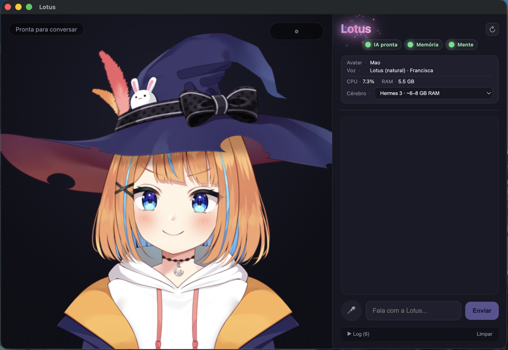
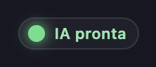
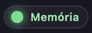
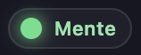

# Lotus


Companion de desktop com **IA local**: avatar **Live2D** animado, chat por texto ou microfone, voz em pt-BR, lip-sync e **agente no computador**. Roda no seu PC (Windows e macOS).



## Começar

1. Instale dependências e assets — ver [Comandos npm](#comandos-npm).
2. Abra com `npm run dev`.
3. Na **primeira abertura**, se ainda não houver modelo instalado, o painel **Cérebro** oferece download pela interface (**Hermes 3** ~5 GB, padrão · **Qwen 2.5** ~2 GB, alternativa leve).
4. Aguarde **IA pronta** (bolinha verde) antes de conversar.



> Hermes 8B + Electron + Live2D usa bastante RAM. Em dev, feche apps pesados em paralelo se o sistema ficar lento.

Detalhes dos modelos: [models/README.md](models/README.md)

---

## Funcionalidades

### Conversa

- Chat em **português do Brasil** com LLM local
- **Pesquisa interna** — *«pesquisa sobre X»* → busca na web e responde no chat
- **Busca no navegador** — *«pesquisa X no Google»* → abre o browser (com confirmação)
- **Interrupção** — nova mensagem ou microfone para a fala anterior na hora
- Atalhos sem LLM: cumprimentos (*oi*), *chega* / *para*

### Agente no computador

A Lotus pode agir no SO **com confirmação do usuário** — abrir Google, apps ou links. Planejamento via function calling (Hermes) + fallback heurístico.

### Avatar e voz

- **Live2D** — galeria integrada ou importe `.model3.json` local
- **Olhar** — mouse, chat ou câmera (MediaPipe, local)
- **Voz** — Edge TTS (internet ao falar) ou GPT-SoVITS local (experimental)
- **Painel** — avatar, voz, cérebro, CPU/RAM, status da IA

### Menu ⚙ (canto da stage)

**Galeria**, **Voz**, **Animação** e **Posição** — ajustes de avatar, síntese de voz, olhar e layout na stage.

---

## Comandos npm

| Comando | Descrição |
|---------|-----------|
| `npm install` | Instala dependências |
| `npm run dev` | Desenvolvimento (Electron + hot reload) |
| `npm run build` | Build de produção |
| `npm run preview` | Preview do build |
| `npm run setup:live2d` | Assets Live2D bundled |
| `npm run setup:models` | Baixa Hermes 3 8B GGUF (~5 GB) |
| `npm run setup:models:qwen` | Baixa Qwen 2.5 3B GGUF (~2 GB) |
| `npm run memory:qdrant` | Sobe Qdrant — Mente semântica (Docker) |
| `npm run memory:qdrant:stop` | Para o container mind1 |
| `npm run setup:voice-ref` | Gera referência de voz (GPT-SoVITS) |
| `npm run setup:gptsovits` | Instala GPT-SoVITS local |
| `npm run setup:voice` | Referência + GPT-SoVITS (tudo de uma vez) |
| `npm run gptsovits:start` | Inicia servidor TTS local (outro terminal) |
| `npm run typecheck` | Verificação TypeScript |
| `npm run dist` | Build + instalador (plataforma atual) |
| `npm run dist:win` | Instalador Windows (.exe) |
| `npm run dist:mac` | Instalador macOS (.dmg) |

**Primeira vez (resumo):** `npm install` → `npm run setup:live2d` → `npm run dev`

**Mente semântica (opcional):** `npm run memory:qdrant` → `npm run dev`

**Voz local experimental (opcional):** `npm run setup:voice-ref` → `npm run setup:gptsovits` → `npm run gptsovits:start` (outro terminal) → `npm run dev`

---

## Memória e Mente

Duas camadas locais com papéis distintos:

| Camada | Ferramenta | O que guarda |
|--------|------------|--------------|
| **Memória** (diário) | SQLite | Turnos, buscas, ações do agente — persiste ao fechar o app |
| **Mente** (semântica) | Qdrant + embeddings | Significado das conversas — recall por tópico, não só palavra exata |

Cada mensagem vai para SQLite; se a Mente estiver online, também para Qdrant (vetores locais, sem API na nuvem). Chat normal usa buffer recente na RAM. Recall (*«lembra do que falamos sobre…?»*, *«o que pesquisei?»*) combina Qdrant, FTS e cronologia. Sem Qdrant o app funciona — recall cai para palavras-chave + histórico.

| Memória (SQLite) | Mente (Qdrant) |
|:---:|:---:|
|  |  |

Documentação: [docs/MEMORY.md](docs/MEMORY.md) · [fluxo detalhado](docs/lotus-memoria-fluxo.md)

---

## Documentação

- [Checklist e roadmap](CHECKLIST.md)
- [Memória local — SQLite + Qdrant](docs/MEMORY.md)
- [Modelos LLM locais](models/README.md)
- [Avatares — galeria e modelos locais](docs/AVATARS.md)

---

## Estrutura do projeto

```
src/
├── main/
│   ├── services/
│   │   ├── agent/          # Agente SO (tools, planner)
│   │   ├── conversation/   # Transcript, recall, atalhos
│   │   ├── memory/         # SQLite (Memória) + Qdrant (Mente)
│   │   ├── intent/         # Browser vs pesquisa interna
│   │   ├── llm.ts          # Chat + research
│   │   ├── search/         # Busca web
│   │   └── tts/            # Síntese de voz
│   └── index.ts            # IPC Electron
├── renderer/
│   └── src/
│       ├── agent/          # UI confirmação do agente
│       ├── avatar/         # Live2D, olhar, lip-sync
│       └── hooks/          # Conversa + interrupção
├── shared/                 # Tipos e contratos IPC
models/                     # GGUF e assets (não versionados)
docker/qdrant-compose.yml   # Qdrant mind1 (Mente)
Screenshot/                 # Capturas de tela
```

---

## Observações

- **Câmera** — permissão local; MediaPipe no renderer, nada enviado à internet
- **Microfone / STT** — Whisper em integração; use texto se a transcrição falhar no seu ambiente
- **Agente** — ações destrutivas pedem confirmação; arquivos/pastas ainda não implementados (ver [CHECKLIST.md](CHECKLIST.md))
- Modelos Live2D oficiais seguem licença Live2D (uso não comercial). Ver licença de cada modelo externo
