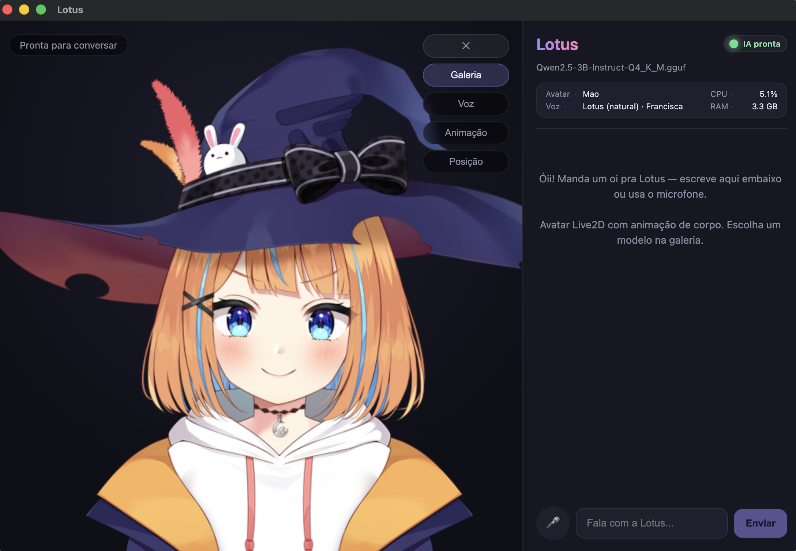

# Lotus


Companion de desktop com **IA local**: avatar **Live2D** animado, chat por texto ou microfone, voz feminina em pt-BR e lip-sync. Roda no seu computador (Windows e macOS).



## Começar

**Na primeira vez**, depois de clonar o repositório:

```bash
npm install
npm run setup:models
npm run setup:live2d
```

**Para abrir o app** (sempre):

```bash
npm run dev
```

Só isso já basta para conversar com a Lotus — avatar, IA local, voz *Lotus (natural) · Francisca* e lip-sync. Aguarde o indicador **IA pronta** (bolinha verde) antes de mandar mensagens.

## Funcionalidades

- **Avatar Live2D** — Hiyori (padrão) e Mao na galeria; importe qualquer `.model3.json` ou escolha na **Galeria → Arquivo local**
- **Cérebro local** — LLM em GGUF (`node-llama-cpp`), com busca na web quando precisa de fatos atuais
- **Voz da Lotus** — *Lotus (natural) · Francisca* via Edge TTS (já incluída; sem setup extra)
- **Lip-sync e corpo** — boca sincronizada com o áudio; idle e gestos nos modelos oficiais
- **Menu de ferramentas** — botão ⚙ na stage: **Galeria**, **Voz**, **Animação** e **Posição**
- **Animação / olhar** — seguir mouse, olhar para o chat ou olhar para você (câmera)
- **Painel lateral** — avatar, voz, **CPU/RAM** e status da IA

---

## Opcional e referência

O restante **não é necessário** para usar o app no dia a dia.

### Voz *Lotus (natural) · Francisca*

A voz padrão **não** usa GPT-SoVITS nem `setup:voice-ref`. Ela já vem com o app.

- Voz neural **Francisca** (pt-BR) via Microsoft Edge TTS — precisa de **internet** ao falar
- Se a síntese falhar, cai para a voz do sistema (Web Speech)
- Ajuste tom e velocidade em **⚙ → Voz**

### Voz anime — *Hiyori (preview)* (opcional)

Somente se quiser **experimentar** voz estilo anime. **Não** é a Francisca.

```bash
npm run setup:voice-ref
npm run setup:gptsovits
npm run gptsovits:start   # outro terminal, ao testar o preview
```

| | Voz padrão | Voz anime (opcional) |
|---|---|---|
| Nome no app | *Lotus (natural) · Francisca* | *Hiyori (preview anime)* |
| Setup | Nenhum (só `setup:models` + `setup:live2d`) | Comandos acima |
| Motor | Edge TTS | GPT-SoVITS local |

### Outros comandos

| Comando | Descrição |
|---------|-----------|
| `npm run build` | Build de produção |
| `npm run dist:win` | Instalador Windows (.exe) |
| `npm run dist:mac` | Instalador macOS (.dmg) |

### Documentação

- [Avatares — arquitetura, galeria e modelos locais](docs/AVATARS.md)

### Estrutura do projeto

```
src/main/       Electron, LLM, TTS, STT, IPC
src/renderer/   React, Live2D, chat, face tracking e áudio
src/shared/     Tipos e contratos IPC
models/         LLM e assets (não versionados)
Screenshot/     Capturas para documentação
```

### Observações

- **Olhar pela câmera** — exige permissão de câmera; processamento local (MediaPipe), nada enviado para a internet
- **Microfone / STT** — whisper em integração; preferir texto se a transcrição falhar no seu ambiente
- Modelos Live2D oficiais são material gratuito Live2D (uso não comercial). Ver licença de cada modelo externo
