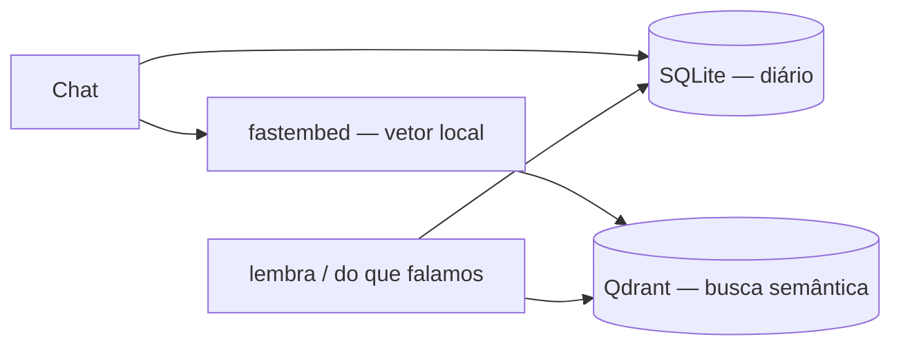

# Memória local da Lotus

A Lotus precisa de **dois papéis** diferentes — confundir os dois é o que faz parecer que “SQLite não serve para IA”:

| Papel | Ferramenta | Para quê |
|--------|-----------|----------|
| **Diário** (o quê / quando) | SQLite | Turnos, buscas Google, ações do agente — sobrevive ao fechar o app |
| **Lembrança semântica** (sobre o quê) | **Qdrant + embeddings** | «Do que falamos de jogos?» mesmo se você disse «PS5» |

SQLite com FTS5 só acha **palavras iguais**. IA de memória precisa de **similaridade de significado** — isso é trabalho de vetor + Qdrant.

## Arquitetura



1. Cada turno vai para **SQLite** (backup estruturado) e para **Qdrant** (embedding via `fastembed`).
2. «Lembra da conversa?» com **tópico** → busca no Qdrant primeiro.
3. «O que pesquisei?» → eventos no SQLite (lista cronológica).
4. «Lembra o que falamos?» (geral) → últimas mensagens no SQLite.

Sem Qdrant rodando, a Lotus ainda funciona — recall vira keyword (FTS) + cronologia, **sem busca semântica**.

## Subir Qdrant

```bash
npm run memory:qdrant
# ou
docker compose -f docker/qdrant-compose.yml up -d
npm run dev
```

Por padrão a Lotus conecta em `http://127.0.0.1:6333`. No Docker Desktop o projeto aparece como **lotus-memory** e o container como **mind1**.

```bash
export LOTUS_QDRANT_URL=http://192.168.1.10:6333
```

## Embeddings (local, sem API)

Modelo padrão: **multilingual-e5-large** (bom para pt-BR). Mais leve em RAM:

```bash
export LOTUS_EMBED_MODEL=bge-small   # inglês, ~384 dim — menos RAM
```

Na primeira execução o `fastembed` baixa o modelo para `userData/memory/embeddings/`.

## Reset de chat

`llmReset` limpa buffer RAM + contexto Hermes — **não apaga** SQLite nem Qdrant.

## Arquivos

```
src/main/services/memory/
  db.ts          — SQLite (diário)
  store.ts       — persistência + FTS fallback
  embeddings.ts  — fastembed (vetores locais)
  qdrant.ts      — indexação e busca semântica
docker/qdrant-compose.yml
```

## Próximos passos

- Reindexar SQLite → Qdrant quando Qdrant volta online
- UI para ver/apagar memórias
- Retenção configurável (ex. > 90 dias)
